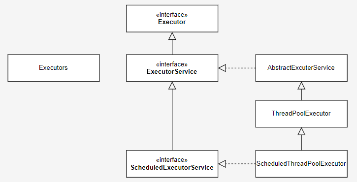

# java.util.concurrent.Executor
> This interface provides a way of decoupling task submission from the mechanics of how each task will be run, including details of thread use, scheduling, etc.   
> An Executor is normally used instead of explicitly creating threads (https://docs.oracle.com/)
- java.lang.thread 를 수행시에 무분별하게 해서 thread 소멸도 제대로 안하고, 그래서 java 진행에서 Pool로 Tread를 관리 할 수 있게 만들어 줬다는 것으로 생각하면 된다.  (여기서는 thread 관련 이야기는 추후 Runable interface를 다시 분석해보자)
- java 진형에서는 일단 하나의 메서드를 가진 인터페이스로 시작하는 것이 간지이다. (심지어 파라메터도 인터페이스이다)

```java
public interface Executor {
    void execute(Runnable command);
}
```


- java.util.coucurrent 패키지에 연관관계


## ExecutrorService
> 실제로 Executor를 상속받은 ExecutrorService가 기본적인 기능의 정보를 가지고 있다    
> (Executor를 상속 받은 인터페이스이며, Executor는 간지는 나지만.. 엄것도 없다)


```java
```

- 가장 단순한 쓰레드를 호출 예제
```java
ExecutorService executorService = Executors.newCachedThreadPool();
// 작업1 (스레드)
executorService.submit(() -> {
    // Something job
});
executorService.shutdown();
```


## java.util.concurrent.Executors
> 나의 지식으로는 약간 애매하다. 추상 팩토리라고 해야 되나? 정적 팩토리 메서드 모듈이라고 해야 되나..   
> 아무튼 ExecutrorService 이하 클래스들을 생성하는 static method 들이 존재한다.


```java
public class Executors {

    public static ExecutorService newFixedThreadPool(int nThreads) {
        return new ThreadPoolExecutor(nThreads, nThreads,
                                      0L, TimeUnit.MILLISECONDS,
                                      new LinkedBlockingQueue<Runnable>());
    }

    public static ExecutorService newCachedThreadPool() {
        return new ThreadPoolExecutor(0, Integer.MAX_VALUE,
                                      60L, TimeUnit.SECONDS,
                                      new SynchronousQueue<Runnable>());
    }
    ...
}
```

## java.util.concurrent.AbstractExecutorService
> 추상클래스도 ExecutorService 기능을 구현하고 있다. 


## java.util.concurrent.ThreadPoolExecutor
> 드디어 나온 Class 구현체, AbstractExecutorService 상속하고 있다 
