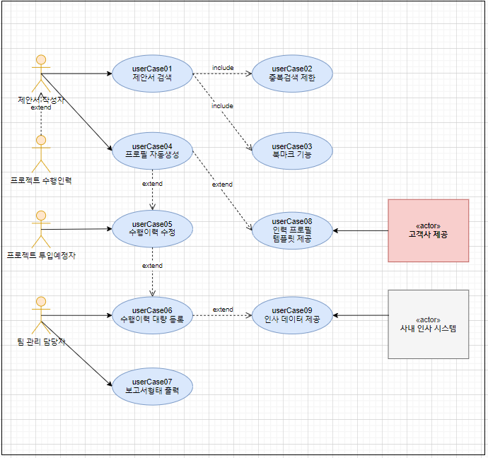

# 제안서 검색 시스템  <!-- omit in toc -->

## 1. Project Overview

### 1.1 Project Background

#### 1.1.1 추진배경

- 제안서는 고객이 공급자에게 자신들의 문제를 해결하기 위한 방법을 제안해 줄 것을 요청하는 제안 요청서(RFP: Request For Proposal)에 대해서 각 공급사별로 자신들의 해결 방안을 제시하면서 자신들을 공급자로 선정해 줄 것을 제안하는 문서입니다. 
- 저희 회사는 공급자로 매번 고객이 요청한 RFP에 맞는 제안서를 작성하고 있습니다. 일부 특수한 영역을 제외한 대부분의 제안서는 비슷한 내용의 이전 제안서를 참고하여 작성하고 있습니다. 
- 하지만 이전 제안서를 검색할 수 있는 기능이 없어서 필요한 경우 이전 제안서 문서를 하나씩 열어서 내용을 검색하고 있어 불필요한 시간 및 인력 낭비가 발생하고 있기에 새로운 제안 시스템에 대한 필요성이 제기되었습니다. 

#### 1.1.2 프로젝트 목표 및 추진방향

- 본 프로젝트는 제안서, 제언서 작성시 이전 작성한 Word, Power Point, Excel 등의 문서에서 키워드 검색을 통해 이전에 작성한 문서에 쉽게 접근할 수 있는 것을 목표로 합니다. 

    
■ 이전 제안서에서 키워드 검색을 통해 문서에 있는 특정 문자를 조회할 수 있습니다.

    
■ 전체 문서를 다운받지 않고도 내용을 확인할 수 있는 미리보기 기능을 제공합니다.

    
■ 인력 프로필 문서를 자동으로 산출할 수 있습니다.

#### 1.1.3 현황

- 제안서 작성현황 (금융 이노베이션1팀 작성기준)

| 구분| 현황 (2022년)|
| --| --|
| 1년 제안서 건수| 25건(제안서 15건, 제언서 10건)|
| 제안서 평균 mm| 투입인원 10명, 1개월 소요 10MM 정도 소요됨|

- 사내 제안서 통합검색 : 회사 내부에는 이미 제안서 통합검색 시스템이 있습니다. 하지만 직접 키워드를 입력해 놓는 방식이며, 각 페이지의 내용을 확인할 수 없고 직접 문서를 다운받는 방식입니다. 

 

### 1.2 Stakeholder List 
#### 1.2.1 제안서 작성자
- 배경: 새로운 제안서를 작성해야되는 인력
- 관심사: 이전에 작성하였던 제안서를 빠르게 확인, 인력 프로필 자동 생성

#### 1.2.2 프로젝트 투입 예정자
- 배경: 제안서 수주되면 프로젝트 투입해야 되는 인력
- 관심사: 제안서마다 변경되는 인력 프로필 템플릿과 상관없이 자신의 프로필을 등록

#### 1.2.3 팀 관리 담당자
- 배경: 팀내 프로젝트 및 인력관리를 담당하는 인력
- 관심사: 팀내 프로젝트 및 인력관리를 액셀이 아닌 시스템으로 수행

#### 1.2.4 프로젝트 수행 인력
- 배경: 등록된 제안서의 프로젝트를 수행하는 인력
- 관심사: 프로젝트 수행중에 고객사와 협상을 위해 프로젝트 제안서를 확인 필요

#### 1.2.5 고객사
- 배경: 자신들의 문제를 해결하기 위해 RFP를 공고하고, 제안서를 받고 싶은 고객사
- 관심사: 한정된 시간내에 RFP 요건을 만족하는 수준높은 제안서를 받고 싶음

#### 1.2.6 사내 인사관리 시스템
- 배경: 사내 직원들의 프로젝트 수행인력을 관리하는 시스템

### 1.3 Business Goal List

| ID| Stakeholder| Business Goal| Importance|
| --| --| --| --|
| businessGoal-01| 제안서 작성자| 이전에 작성된 제안서를 쉽고 빠르게 접근| 상|
| businessGoal-02| 제안서 작성자| 고객사에서 제공한 템플릿 맞는 인력 프로필을 자동 생성| 상|
| businessGoal-03| 제안서 작성자| 이미 검색한 제안서의 중복적인 검색을 제한| 하|
| businessGoal-04| 제안서 작성자| 필요한 제안서 페이지에 대한 북마크 기능을 제공| 하|
| businessGoal-05| 제안서 작성자| 완성된 제안서를 시스템에 쉽게 등록| 상|
| businessGoal-06| 프로젝트 투입 예정자| 통합된 시스템으로 자신의 프로젝트 수행이력을 한번만 등록한다| 중|
| businessGoal-07| 프로젝트 투입 예정자| 자신의 프로젝트 수행이력을 쉽게 확인| 하|
| businessGoal-08| 팀 관리 담당자| 팀 내부의 인력 투입현황을 시스템으로 관리| 중|
| businessGoal-09| 팀 관리 담당자| 인력 투입현황을 보고서 형태로 출력| 하|
| businessGoal-10| 프로젝트 수행 인력| 프로젝트 수행시 필요한 부분의 제안서 내용을 확인| 상|
| businessGoal-11| 고객사| RFP 요건을 만족하는 수준높은 제안서 제공 받음| 중|

## 2. System Overview
### 2.1 System Context Diagram

### 2.2 External Entity List
> 신규 시스템으로 시스템 숙련도는 제외합니다

#### 2.2.1 제안서 작성자
- 유형: 사용자
- 역할: 제안서 검색 기능을 통해 이전 제안서를 검색하고, 인력프로필을 출력한다
- 핵심기대사항: 이전 제안서 조회시 편의성 및 정확성, 인력프로필 생성 자동화

#### 2.2.2 프로젝트 투입 예정자
- 유형: 사용자
- 역할: 자신의 프로젝트 투입 이력을 작성한다.
- 핵심기대사항: 반복적인 인력프로필 작성 중단

#### 2.2.3 팀 관리 담당자
- 유형: 사용자
- 역할: 팀 인력현황을 관리한다.
- 핵심기대사항: 시스템으로 팀 인력현황을 관리하여 효율성 

#### 2.2.4 프로젝트 수행 인력
- 유형: 사용자
- 역할: 프로젝트 수행시 필요한 제안서 내용을 확인한다
- 핵심기대사항: 제안서 조회시 편의성 및 정확성

#### 2.2.5 고객사
- 유형: 사용자
- 배경: 제안서에 포함될 인력프로필 템플릿을 제공
- 핵심기대사항: 제안서의 품질 향상

#### 2.2.6 사내 인사관리 시스템
- 유형: 시스템
- 배경: 기존에 사내 인사정보를 제공한다
- 핵심기대사항: 없음

### 2.3 External Interface List 

#### 2.3.1 제안서 검색 (키워드)
* 역할: 기존의 등록된 제언/제안서에서 특정 키워드로 검색기능을 제공한다
* 특성: 
    * 특정 키워드를 검색 알고리즘을 통해 빠르게 접근
    * 파일 다운로드 없이 Web에서 미리보기 기능 제공

#### 2.3.2 인력 프로필 자동 생성
* 역할: 고객사에서 요청한 템플릿형태로 인력프로필을 자동으로 생성한다
* 특성:
  * 고객사마다 요청하는 인력프로필 형태가 다르다
  * 변경없는 인력프로필을 제안마다 작성하는 것은 불필요한 추가 업무

### 2.4 System Feature List
 
| ID| Title| Description| Importance| Related BG|
| --| --| ----| --|--|
| systemFeature-01| 제안서 검색 속도| 제안서의 Text 마다 검색이 되어야 함으로 검색       속도| 상|businessGoal-01 businessGoal-10|
| systemFeature-02| UI 설계를 통한 사용자 편의성| 제안서 작성에 효율성을 높이기 위한 시스템으로 사용자 편의성| 중| businessGoal-03 businessGoal-04 businessGoal-05 businessGoal-08|
| systemFeature-03| 다른 플랫폼과 연계를 위한 확장성| 외부에 프로젝트 투입된 인력도 편하게 사용할 수 있게 외부 플랫폼(모바일)과 확장| 중| businessGoal-06 businessGoal-07|
 
 
## 3. Architectural Driver

### 3.1 Use Case Model

#### 3.1.1 Use Case Diagram

### 3.1.2 Use Case List 

#### 3.1.2.1 제안서를 검색 (userCase01)
* Description: 제안 작성자가 이전 프로젝트 제안/제언서를 키워드를 통해 검색한다
* Priority(I/D): 상/상
* Related System Feature ID: systemFeature-01

#### 3.1.2.2 중복검색 제한 (userCase02)
* Description: 제안 작성자가 이전에 검색하였던 제안서는 중복해서 검색하지 않도록 읽음 표시를 한다
* Priority(I/D): 하/하
* Related System Feature ID: systemFeature-01, systemFeature-02

#### 3.1.2.3 북마크 기능 (userCase03)
* Description: 제안 작성자가 이전에 검색하였던 제안서를 북마크하여 이후에도 쉽게 찾을 수 있다
* Priority(I/D): 하/하                 
* Related System Feature ID: systemFeature-02

#### 3.1.2.4 프로필 자동생성 (userCase04)
* Description: 제안 작성자는 고객사에게 받은 템플릿 형태로 프로필을 자동생성 한다
* Priority(I/D): 중/상
* Related System Feature ID: systemFeature-02
 
#### 3.1.2.5 수행이력 수정 (userCase05)
* Description: 프로젝트 투입예정자는 자신의 프로젝트 투입 이력을 수정한다
* Priority(I/D): 중/상
* Related System Feature ID: systemFeature-02, systemFeature-03 

#### 3.1.2.6 수행이력 대량 등록 (userCase06)
* Description: 팀 관리 담당자는 인사시스템에서 다운받은 인사시스템 데이터를 한번에 등록할 수 있다
* Priority(I/D): 중/중
* Related System Feature ID: systemFeature-02

#### 3.1.2.7 투입현황을 보고서형태로 추력 (userCase07)
* Description: 팀 관리 담당자는 수행이력을 토대로 매주 보고서형태로 출력할 수 있다
* Priority(I/D): 하/하
* Related System Feature ID: systemFeature-02
  
#### 3.1.2.8 인력 프로필 템플릿 제공 (userCase08)
* Description: 고객사들의 자신들이 원한 형태의 인력 프로필 템플릿을 제공한다
* Priority(I/D): 중/하
* Related System Feature ID: systemFeature-03

#### 3.1.2.9 인사 데이터를 제공(userCase09)
* Description: 사내 인사관리 시스템에서 투입예정자들에 대한 인사 데이터를 제공한다
* Priority(I/D): 중/중
* Related System Feature ID: systemFeature-03

## 3.2.	Quality Attribute Scenario

### 3.2.1 QA Scenario List

| ID| Title| QA Type| I| D| Related SF|
| --| --| --|--|--|--|
| QualityAttr01| 제안서를 검색 시간 최소화| 편의성, 사용성| 상| 상| systemFeature-01|

### 3.2.2 제안서를 검색 시간 최소화
* QA Type: 편의성, 사용성
* Description: 
* Priority(I/D): 상/상

QA Type	변경용이성
Description	EMR 시스템이 개발되어 운영 중인 상태에서 진료예약 기능을 추가 개발하여 적용한다.
Source of Stimulus	시스템 유지보수 담당자
Stimulus	진료예약 기능의 추가
Artifact	EMR 시스템
Environment	EMR 시스템 개발이 완료되어 운영 중인 상태
시스템 유지보수 담당자는 3개월 간의 인수인계를 받은 상태
진료예약 기능은 진료예약에 대한 단순 등록/수정/조회/삭제/목록으로 이루어진 기본 기능만을 제공
Response	진료예약 기능이 개발 완료되어 EMR 시스템에 적용 완료.
Response Measure	개발 소요 시간: 최대 1MM
